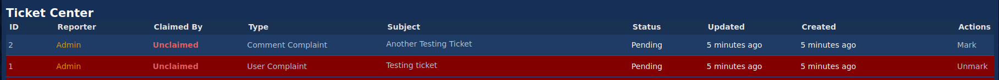

# E621 Ticket Marker
A way to mark e621 tickets you don't want to handle.

To install this script, install a userscript manager, then click [here](https://github.com/DonovanDMC/E621TicketMarker/releases/latest/download/script.user.js).  
This script *may* either expand the tickets table beyond the page width, or further make the problem worse.
